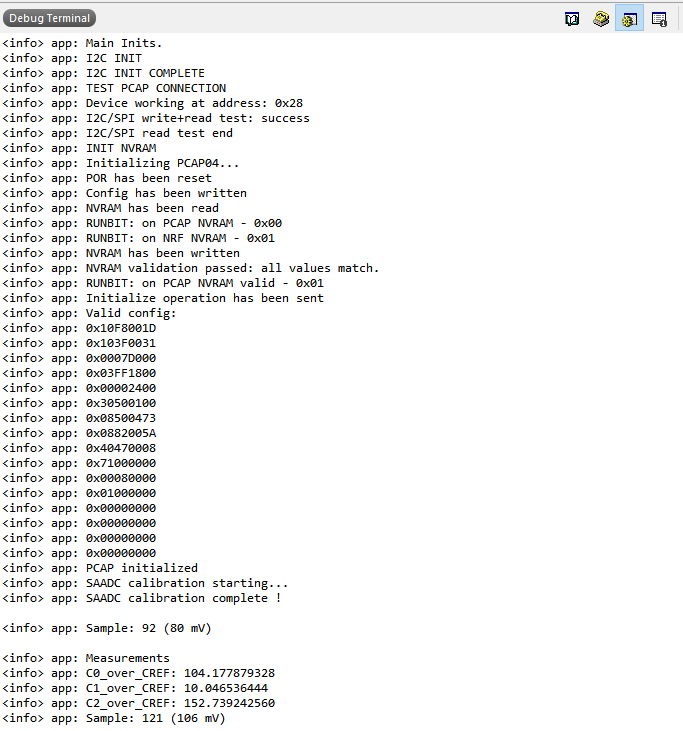
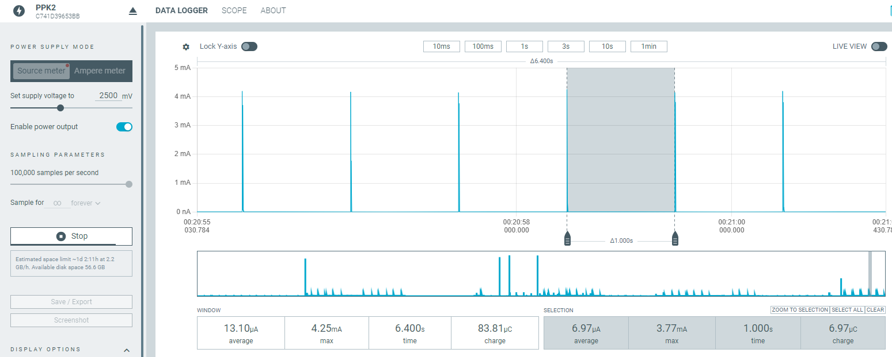
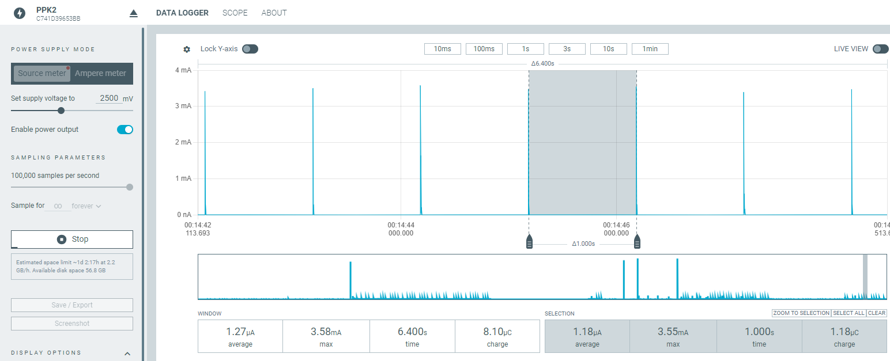

# nRF52833-I2C-SPI-PCAP04-Low-Power-Capacitive-Sensing

This repository contains a low-power capacitive sensing application using the **nRF52833 Development Kit (PCA10100)** and the **PCAP04 capacitive-to-digital converter**. It supports both **I2C** and **SPI** communication interfaces, allowing users to test and benchmark either protocol with the same firmware base.

The Real-Time Counter (RTC) is configured to wake up the MCU every second to acquire a capacitive measurement and then return the system to sleep, optimizing power consumption.

> 🛠️ **This implementation is based on and adapted from:**
> - [sciosense/pcap04-sample-code](https://github.com/sciosense/pcap04-sample-code)
> - [ShayanMajumder/PCap04-Toolkit](https://github.com/ShayanMajumder/PCap04-Toolkit)
---

## 📦 Features

* ✅ Supports both **I2C** and **SPI** communication with PCAP04
* ✅ RTC-triggered low-power operation (default interval: 1 second)
* ✅ Logging via **SEGGER RTT**
* ✅ Modular communication abstraction layer (via `pcap_hal`)
* ✅ Integrated SAADC sampling for voltage monitoring
* ✅ LED indicators and error logging support

---

## 🔧 Hardware Requirements

* [nRF52833 DK (PCA10100)](https://www.nordicsemi.com/Products/Development-hardware/nRF52833-DK)
* [PCAP04 Evaluation Board](https://www.ichaus.de/PCAP04)
* Capacitive sensing electrodes (e.g., interdigitated pads)
* Optional: Nordic Power Profiler Kit II (PPK2) for current measurement

---

## 🛠️ Software Setup

* **SDK:** Nordic nRF5 SDK 17.1.0
* **Toolchain:** SEGGER Embedded Studio for ARM (v5.42a tested)
* **SoftDevice:** Not required

> 📁 To use this project:
>
> 1. Copy the project folder into:
>    `nRF5_SDK_17.1.0_ddde560/examples/peripheral/`
> 2. Open the `.emProject` file in
>    `pca10100/blank/ses/`
> 3. Build and flash using SEGGER Embedded Studio

---

## 📂 File Structure

| File                                                              | Description                                                           |
| ----------------------------------------------------------------- | --------------------------------------------------------------------- |
| `main.c`                                                          | Initializes RTC, SAADC, PCAP04 via I2C/SPI and logs periodic readings |
| `pcap_hal.*`                                                      | Hardware abstraction layer for I2C/SPI switching                      |
| `i2c_interface.*` / `spi_interface.*`                             | Bus-specific drivers                                                  |
| `pcap04.*`                                                        | Core PCAP04 control logic and configuration                           |
| `pcap_configurations.h`, `pcap_firmware.h`, `pcap_calibrations.h` | Configuration data blocks for PCAP04                                  |
| `pcap_registers.h` / `pcap_types.h`                               | Complete register mapping and structures                              |

---

## 🔢 Pin Configuration (nRF52833)

| Function         | Pin   | Notes            |
| ---------------- | ----- | ---------------- |
| I2C SCL          | P0.27 | External DK pull-up |
| I2C SDA          | P0.26 | External DK pull-up |
| SPI SCK          | P0.20 |                  |
| SPI MOSI         | P0.21 |                  |
| SPI MISO         | P0.19 |                  |
| SPI CS           | P0.22 | Active low       |
| Interface Select | P0.23 | 0 = SPI, 1 = I2C |

---

## ⚙️ Sampling Strategy

* **Interval:** 1 second (adjustable via `SAADC_SAMPLE_INTERVAL_SEC`)
* **RTC:** 32 Hz wake-up using RTC2
* **SAADC:** Samples AIN0 (P0.02) voltage
* **PCAP04:** Captures capacitance reading, logs via RTT
* **LEDs:** Toggled on SAADC and PCAP sampling events

---

## ⚡ Power Optimization

* MCU sleeps using `nrf_pwr_mgmt_run()` loop
* PCAP04 powered and sampled only when required
* SAADC deactivated between samples
* RTC is used instead of TIMER for low-power wake-ups

---

## 💡 Interface Selection

Modify `main.c`:

```c
pcap_hal_init(PCAP_HAL_IFACE_I2C); // or PCAP_HAL_IFACE_SPI
```

This sets the digital pin P0.23 high/low and initializes the corresponding driver.

---

## 🔄 LED Feedback

| LED  | Indication             |
| ---- | ---------------------- |
| LED1 | SAADC sample complete  |
| LED2 | PCAP04 reading logged  |

---

## 📊 Example Output (Debug Terminal)
Below is an example log captured during operation using the I2C interface:


## 📉 Power Consumption Comparison (TBD)

The following table will show upcoming results from Nordic Power Profiler Kit II (PPK2), comparing I2C and SPI modes for capacitive sensing using PCAP04. Measurements are in progress.
| Interface                     | Average Current | Max Current  | Plot                                     |
| ----------------------------- | --------------- | -----------  | ---------------------------------------- |
| I2C					        | 13.10 µA         | 3.77 mA      |         |
| SPI							| 1.27 µA         | 3.55 mA      |  |

These results highlight the lower average current and charge consumption of the polling-based SAADC sampling approach.

## 📄 License

This project uses Nordic Semiconductor’s SDK license.

---

## 👨‍💼 Author

Developed by **Spyros Daskalakis**, demonstrating efficient capacitive sensing with configurable digital interfaces on the nRF52 platform.

---
